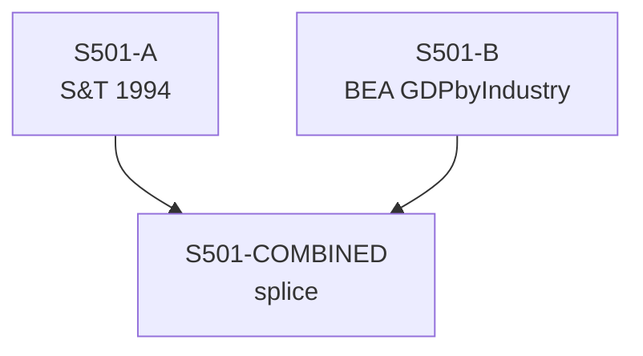

# S501 — Decomposition

**Series**: Total Product (TP*)

## Construction Flow

## Step-by-step construction

**Step 1** — load
  - Inputs: S501-A

**Step 2** — load
  - Inputs: S501-B

**Step 3** — splice
  - Inputs: S501-A, S501-B
  - Output: `S501-COMBINED`
  - At year: 1997
  - Method: growth_rate

## Extension

- Splice year: 1997
- Splice method: growth_rate
- Depends on: (none)

## Provenance

See [`S501_DPR.md`](S501_DPR.md) for the canonical Data Provenance Record, including source-file citations, validation benchmarks, and known caveats.
