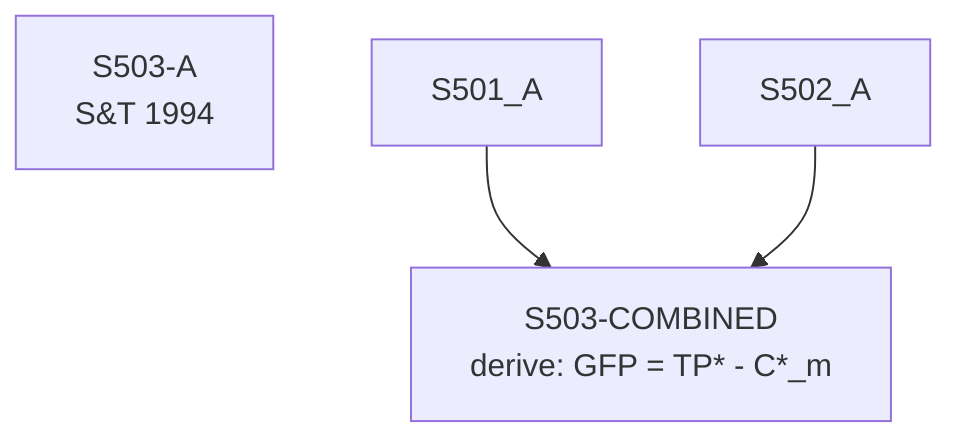

# S503 — Decomposition

**Series**: Gross Final Product (GFP = TP* - C*_m)

## Construction Flow

## Step-by-step construction

**Step 1** — load
  - Inputs: S503-A

**Step 2** — derive
  - Inputs: S501-A, S502-A
  - Output: `S503-COMBINED`
  - Formula: `GFP = TP* - C*_m`

## Extension

Not extended — series is `book_period_only` or marked `pending_capital_stock_data`. See DPR.

## Provenance

See [`S503_DPR.md`](S503_DPR.md) for the canonical Data Provenance Record, including source-file citations, validation benchmarks, and known caveats.
