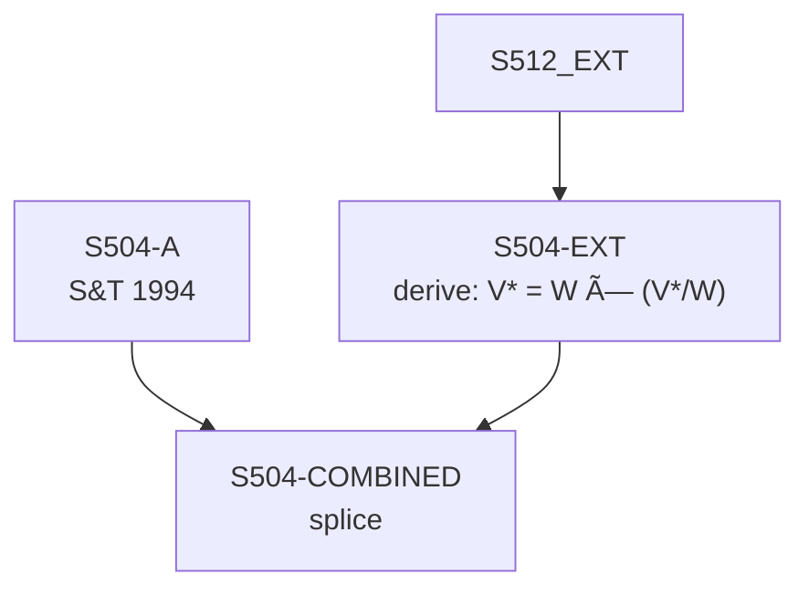

# S504 — Decomposition

**Series**: Variable Capital (V*)

## Construction Flow

## Step-by-step construction

**Step 1** — load
  - Inputs: S504-A

**Step 2** — derive
  - Inputs: S512-EXT
  - Output: `S504-EXT`
  - Formula: `V* = W × (V*/W)`

**Step 3** — splice
  - Inputs: S504-A, S504-EXT
  - Output: `S504-COMBINED`
  - At year: 1989

## Extension

- Splice year: 1989
- Splice method: derive
- Depends on: S512

## Provenance

See [`S504_DPR.md`](S504_DPR.md) for the canonical Data Provenance Record, including source-file citations, validation benchmarks, and known caveats.
