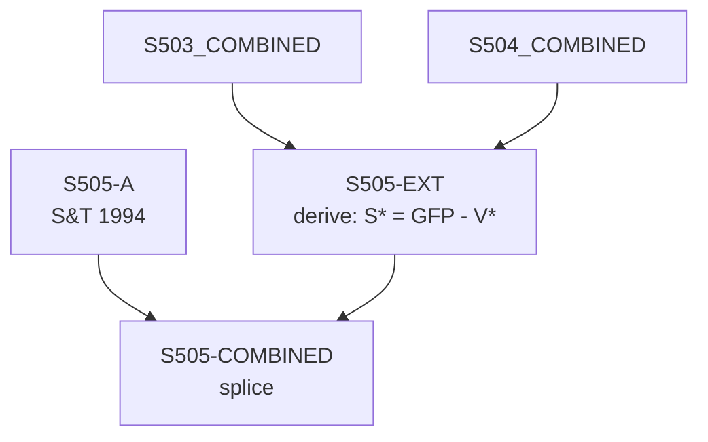

# S505 — Decomposition

**Series**: Surplus Value (S* = VA* - V*)

## Construction Flow

## Step-by-step construction

**Step 1** — load
  - Inputs: S505-A

**Step 2** — derive
  - Inputs: S503-COMBINED, S504-COMBINED
  - Output: `S505-EXT`
  - Formula: `S* = GFP - V*`

**Step 3** — splice
  - Inputs: S505-A, S505-EXT
  - Output: `S505-COMBINED`
  - At year: 1989

## Extension

- Splice year: 1989
- Splice method: derive
- Depends on: S503, S504

## Provenance

See [`S505_DPR.md`](S505_DPR.md) for the canonical Data Provenance Record, including source-file citations, validation benchmarks, and known caveats.
