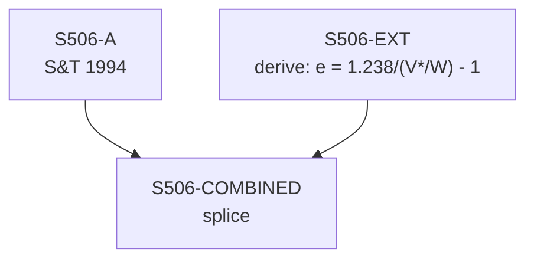

# S506 — Decomposition

**Series**: Rate of Exploitation (e = S*/V*)

## Construction Flow

## Step-by-step construction

**Step 1** — load
  - Inputs: S506-A

**Step 2** — derive
  - Output: `S506-EXT`
  - Formula: `e = 1.238/(V*/W) - 1`

**Step 3** — splice
  - Inputs: S506-A, S506-EXT
  - Output: `S506-COMBINED`
  - At year: 1989

## Extension

- Splice year: 1989
- Splice method: derive
- Depends on: S512

## Provenance

See [`S506_DPR.md`](S506_DPR.md) for the canonical Data Provenance Record, including source-file citations, validation benchmarks, and known caveats.
