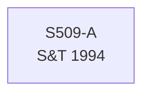

# S509 — Decomposition

**Series**: Productive Investment (IG*)

## Construction Flow

## Step-by-step construction

**Step 1** — load
  - Inputs: S509-A

## Extension

Not extended — series is `book_period_only` or marked `pending_capital_stock_data`. See DPR.

## Provenance

See [`S509_DPR.md`](S509_DPR.md) for the canonical Data Provenance Record, including source-file citations, validation benchmarks, and known caveats.
