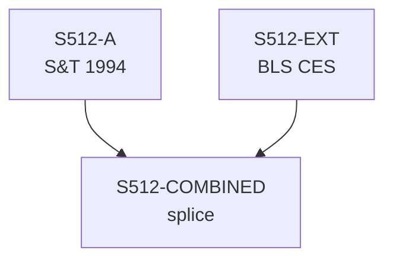

# S512 — Decomposition

**Series**: Productive Wage Share (V*/W)

## Construction Flow

## Step-by-step construction

**Step 1** — load
  - Inputs: S512-A

**Step 2** — load
  - Inputs: S512-EXT

**Step 3** — splice
  - Inputs: S512-A, S512-EXT
  - Output: `S512-COMBINED`
  - At year: 1989

## Extension

- Splice year: 1989
- Splice method: level
- Depends on: (none)

## Provenance

See [`S512_DPR.md`](S512_DPR.md) for the canonical Data Provenance Record, including source-file citations, validation benchmarks, and known caveats.
