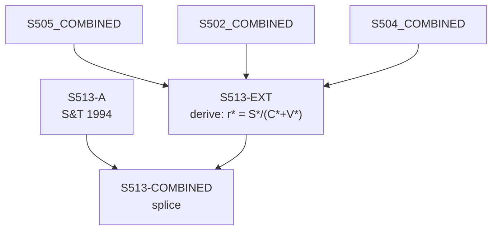

# S513 — Decomposition

**Series**: Marxian Profit Rate (r* = S*/(C*+V*))

## Construction Flow

## Step-by-step construction

**Step 1** — load
  - Inputs: S513-A

**Step 2** — derive
  - Inputs: S505-COMBINED, S502-COMBINED, S504-COMBINED
  - Output: `S513-EXT`
  - Formula: `r* = S*/(C*+V*)`

**Step 3** — splice
  - Inputs: S513-A, S513-EXT
  - Output: `S513-COMBINED`
  - At year: 1989

## Extension

- Splice year: 1989
- Splice method: derive
- Depends on: S502, S504, S505

## Provenance

See [`S513_DPR.md`](S513_DPR.md) for the canonical Data Provenance Record, including source-file citations, validation benchmarks, and known caveats.
