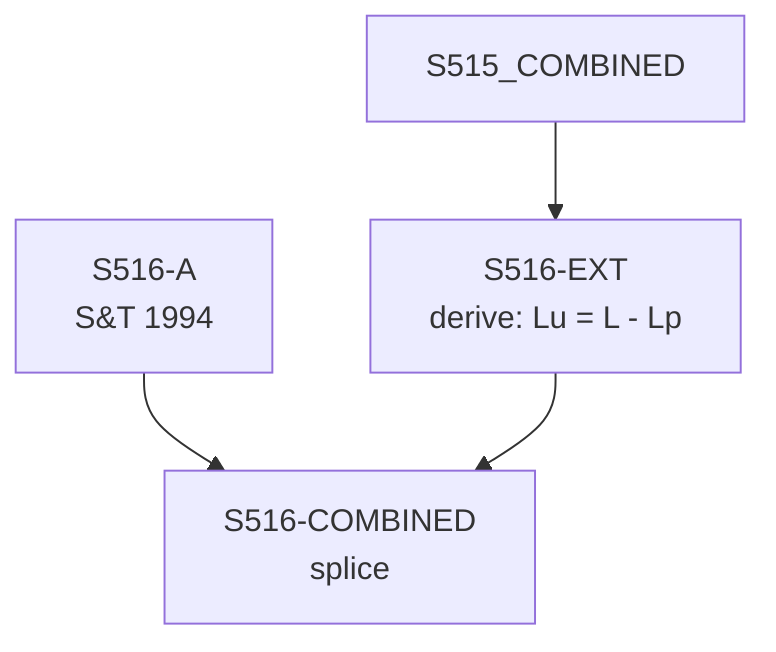

# S516 — Decomposition

**Series**: Unproductive Employment (Lu = L - Lp)

## Construction Flow

## Step-by-step construction

**Step 1** — load
  - Inputs: S516-A

**Step 2** — derive
  - Inputs: S515-COMBINED
  - Output: `S516-EXT`
  - Formula: `Lu = L - Lp`

**Step 3** — splice
  - Inputs: S516-A, S516-EXT
  - Output: `S516-COMBINED`
  - At year: 1989

## Extension

- Splice year: 1989
- Splice method: derive
- Depends on: S515

## Provenance

See [`S516_DPR.md`](S516_DPR.md) for the canonical Data Provenance Record, including source-file citations, validation benchmarks, and known caveats.
