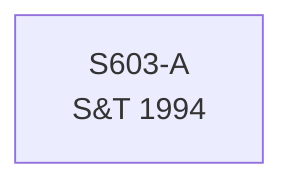

# S603 — Decomposition

**Series**: Property Tax Workers

## Construction Flow

## Step-by-step construction

**Step 1** — load; inputs=['S603-A']; output=``; formula=``

## Extension

Not extended — book period only.

## Provenance

See [`S603_DPR.md`](S603_DPR.md).
