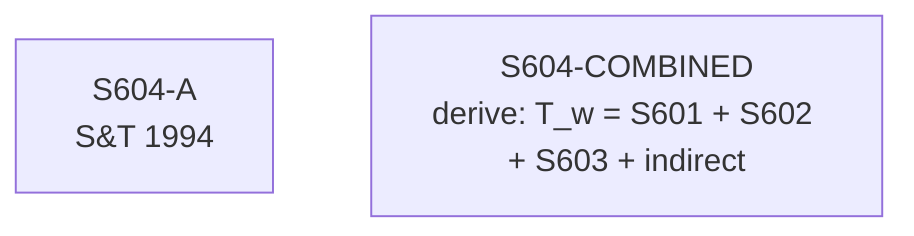

# S604 — Decomposition

**Series**: Total Tax Workers (T_w = sum)

## Construction Flow

## Step-by-step construction

**Step 1** — load; inputs=['S601-A', 'S602-A', 'S603-A']; output=``; formula=``
**Step 2** — derive; inputs=[]; output=`S604-COMBINED`; formula=`T_w = S601 + S602 + S603 + indirect`

## Extension

Not extended — book period only.

## Provenance

See [`S604_DPR.md`](S604_DPR.md).
