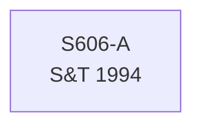

# S606 — Decomposition

**Series**: Government Services Workers (G_w)

## Construction Flow

## Step-by-step construction

**Step 1** — load; inputs=['S606-A']; output=``; formula=``

## Extension

Not extended — book period only.

## Provenance

See [`S606_DPR.md`](S606_DPR.md).
