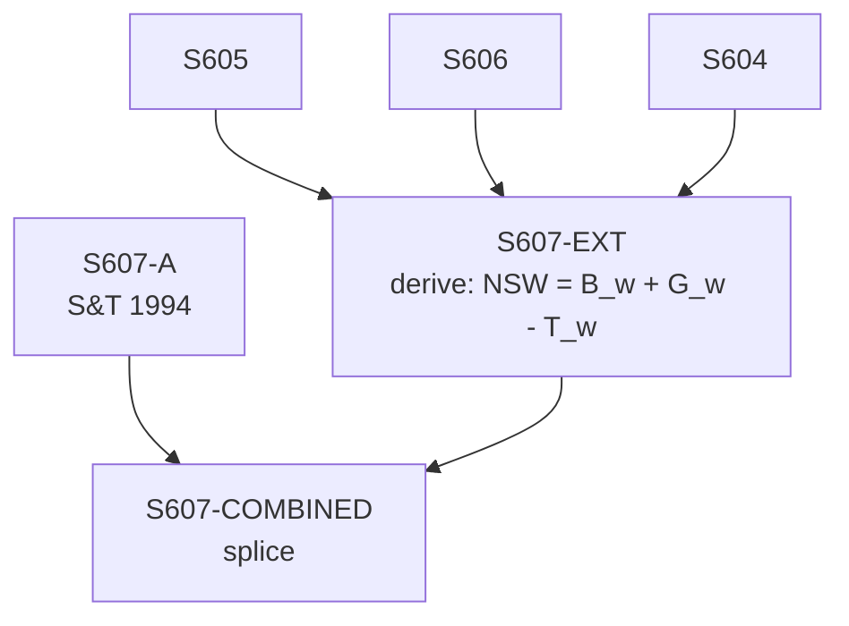

# S607 — Decomposition

**Series**: Net Social Wage (NSW = B_w + G_w - T_w)

## Construction Flow

## Step-by-step construction

**Step 1** — load; inputs=['S607-A']; output=``; formula=``
**Step 2** — derive; inputs=['S605', 'S606', 'S604']; output=`S607-EXT`; formula=`NSW = B_w + G_w - T_w`
**Step 3** — splice; inputs=['S607-A', 'S607-EXT']; output=`S607-COMBINED`; formula=``

## Extension

Splice year: 1989; method: `derive`; depends on: S604, S605, S606

## Provenance

See [`S607_DPR.md`](S607_DPR.md).
