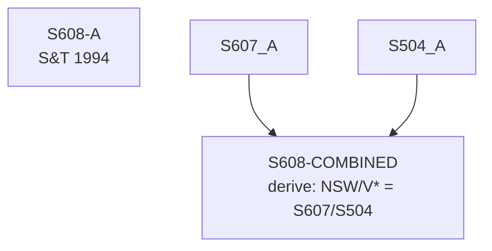

# S608 — Decomposition

**Series**: NSW/V* Ratio

## Construction Flow

## Step-by-step construction

**Step 1** — derive; inputs=['S607-A', 'S504-A']; output=`S608-COMBINED`; formula=`NSW/V* = S607/S504`

## Extension

Not extended — book period only.

## Provenance

See [`S608_DPR.md`](S608_DPR.md).
