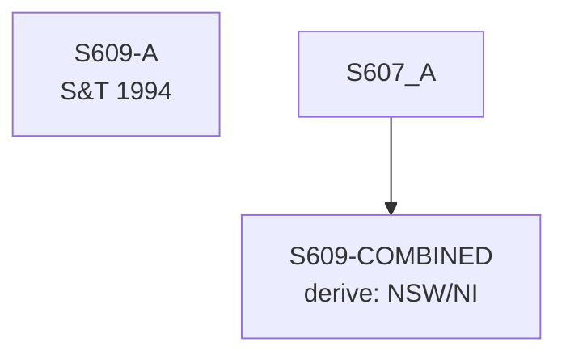

# S609 — Decomposition

**Series**: NSW/NI Share

## Construction Flow

## Step-by-step construction

**Step 1** — derive; inputs=['S607-A']; output=`S609-COMBINED`; formula=`NSW/NI`

## Extension

Not extended — book period only.

## Provenance

See [`S609_DPR.md`](S609_DPR.md).
