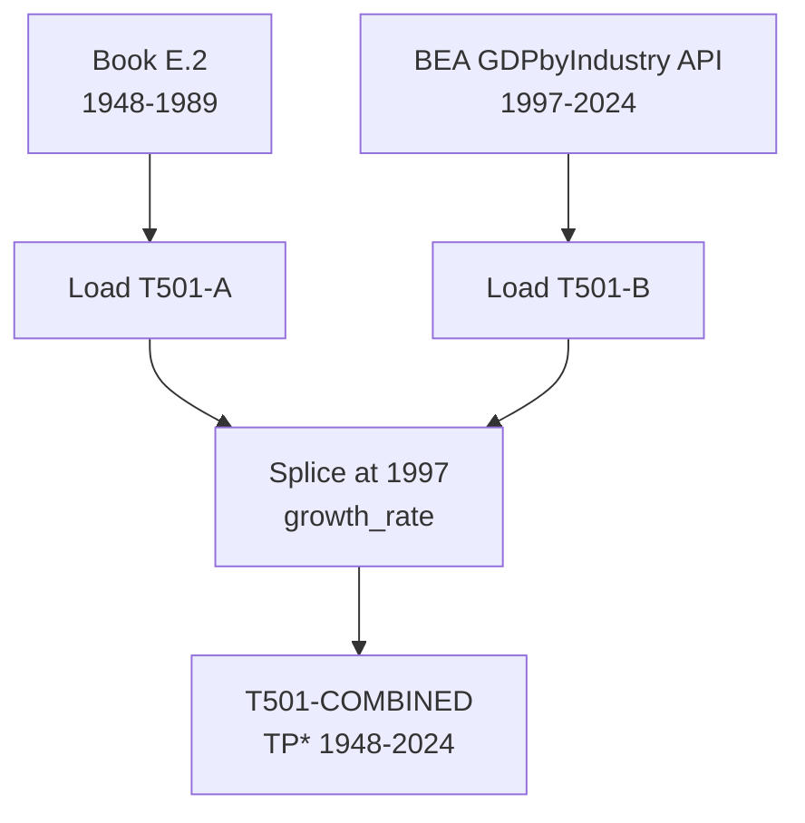

# T501: TP* — Decomposition

## Quick Reference

| Property | Value |
|----------|-------|
| Series ID | T501 |
| Name | TP* (Total Product, classical) |
| Chapter | 5 |
| Book Table | E.2 |
| Period | 1948-2024 |
| Units | Billions of current dollars |
| Tier | 1 |
| Wave | 1 |

## Sub-Components

| Subseries | Name | Source | Period | Units |
|-----------|------|--------|--------|-------|
| T501-A | TP* (book) | Book E.2 | 1948-1989 | Billions $ |
| T501-B | TP* (extension) | BEA GDPbyIndustry | 1997-2024 | Billions $ |
| T501-COMBINED | TP* (full) | Spliced A+B | 1948-2024 | Billions $ |

## Construction Steps

| Step | Operation | Input | Output | Notes |
|------|-----------|-------|--------|-------|
| 1 | load | Book E.2 | T501-A | Historical series 1948-1989 |
| 2 | load | BEA GDPbyIndustry API | T501-B | Modern series 1997-2024 |
| 3 | splice | T501-A, T501-B | T501-COMBINED | Splice at 1997, growth_rate method |

## Flow Diagram

## Source Methodology

See `Technical/research/T501_research.json` for full research documentation.

### Key Formula
TP* = Total Product in classical terms, measuring gross output of the productive sector net of non-capitalist activities.

### NIPA Sources
- BEA GDPbyIndustry tables provide sectoral gross output for the extension period (1997-2024).
- Book E.2 provides the benchmark historical series from Shaikh's calculations.

## Related Series
- Upstream: None (primary source)
- Downstream: T503 (GFP = TP* - C*_m)
