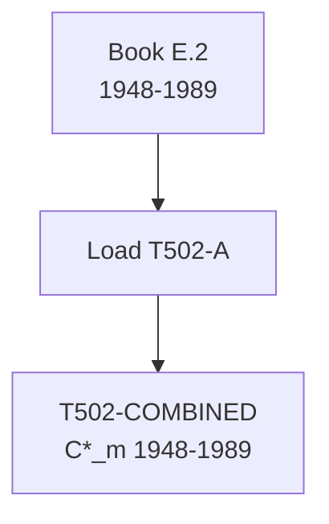

# T502: C*_m — Decomposition

## Quick Reference

| Property | Value |
|----------|-------|
| Series ID | T502 |
| Name | C*_m (Materials cost, classical) |
| Chapter | 5 |
| Book Table | E.2 |
| Period | 1948-1989 |
| Units | Billions of current dollars |
| Tier | 1 |
| Wave | 1 |

## Sub-Components

| Subseries | Name | Source | Period | Units |
|-----------|------|--------|--------|-------|
| T502-A | C*_m (book) | Book E.2 | 1948-1989 | Billions $ |
| T502-COMBINED | C*_m (full) | T502-A only | 1948-1989 | Billions $ |

## Construction Steps

| Step | Operation | Input | Output | Notes |
|------|-----------|-------|--------|-------|
| 1 | load | Book E.2 | T502-A | Historical series 1948-1989 |
| 2 | passthrough | T502-A | T502-COMBINED | No extension available |

## Flow Diagram

## Source Methodology

See `Technical/research/T502_research.json` for full research documentation.

### Key Formula
C*_m = Intermediate materials cost in classical terms. Represents the circulating constant capital consumed in production.

### NIPA Sources
- Book E.2 provides the only available series. No modern extension source identified.

## Related Series
- Upstream: None (primary source)
- Downstream: T503 (GFP = TP* - C*_m), T510 (C*/V*)
