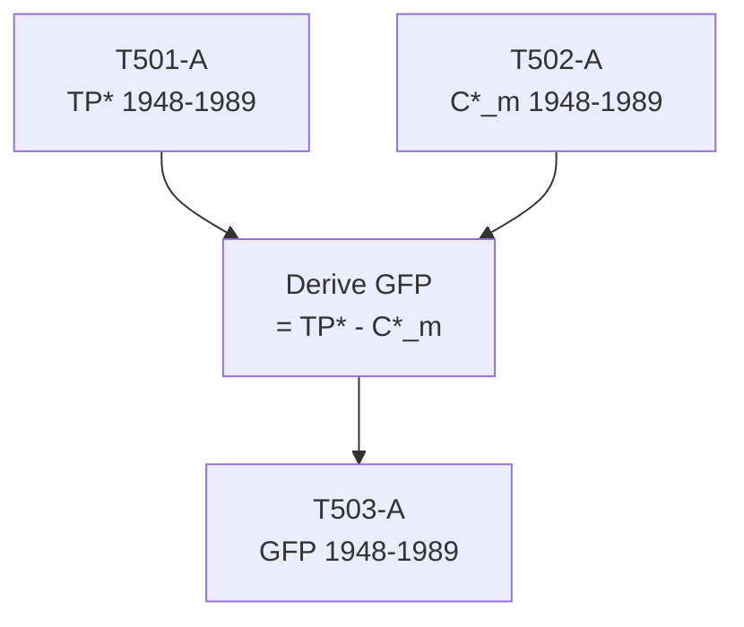

# T503: GFP — Decomposition

## Quick Reference

| Property | Value |
|----------|-------|
| Series ID | T503 |
| Name | GFP (Gross Feudal Product, classical value added) |
| Chapter | 5 |
| Book Table | E.2 |
| Period | 1948-1989 |
| Units | Billions of current dollars |
| Tier | 1 |
| Wave | 1 |

## Sub-Components

| Subseries | Name | Source | Period | Units |
|-----------|------|--------|--------|-------|
| T503-A | GFP (book) | Book E.2 | 1948-1989 | Billions $ |

## Construction Steps

| Step | Operation | Input | Output | Notes |
|------|-----------|-------|--------|-------|
| 1 | load | T501-A (TP*) | T501-A | Dependency: total product |
| 2 | load | T502-A (C*_m) | T502-A | Dependency: materials cost |
| 3 | derive | T501-A - T502-A | T503-A | GFP = TP* - C*_m |

## Flow Diagram

## Source Methodology

See `Technical/research/T503_research.json` for full research documentation.

### Key Formula
GFP = TP* - C*_m

Gross Feudal Product represents value added in the classical sense — total product minus materials cost. This is the pool from which wages (V*) and surplus (S*) are drawn.

### NIPA Sources
- Derived entirely from T501 and T502; no independent NIPA source.

## Related Series
- Upstream: T501 (TP*), T502 (C*_m)
- Downstream: T505 (S* = GFP - V*), T507 (S*/Y)
