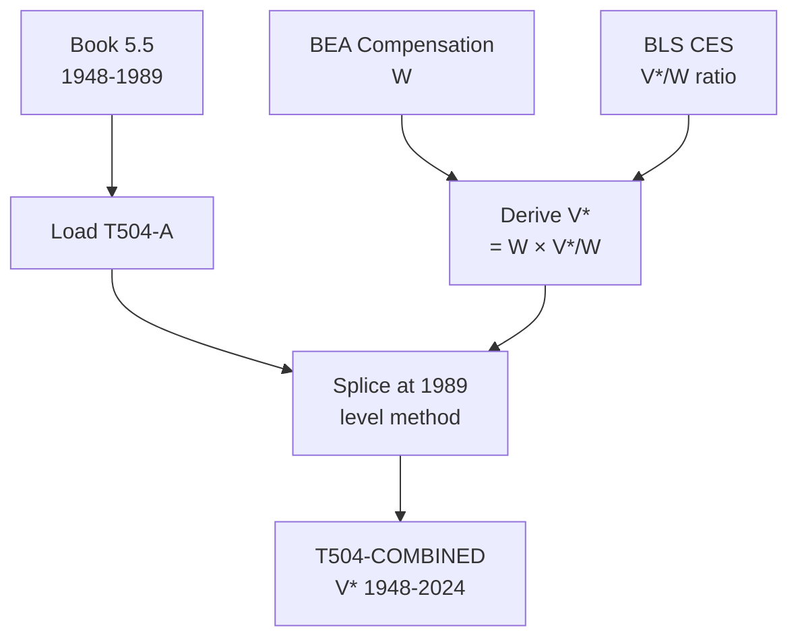

# T504: V* — Decomposition

## Quick Reference

| Property | Value |
|----------|-------|
| Series ID | T504 |
| Name | V* (Variable capital / wages of productive workers) |
| Chapter | 5 |
| Book Table | 5.5 |
| Period | 1948-2024 |
| Units | Billions of current dollars |
| Tier | 1 |
| Wave | 1 |

## Sub-Components

| Subseries | Name | Source | Period | Units |
|-----------|------|--------|--------|-------|
| T504-A | V* (book) | Book 5.5 | 1948-1989 | Billions $ |
| T504-EXT | V* (extension) | BEA + BLS derived | 1990-2024 | Billions $ |
| T504-COMBINED | V* (full) | Spliced A+EXT | 1948-2024 | Billions $ |

## Construction Steps

| Step | Operation | Input | Output | Notes |
|------|-----------|-------|--------|-------|
| 1 | load | Book 5.5 | T504-A | Historical series 1948-1989 |
| 2 | load | BEA compensation, BLS Lp/L | W, V*/W | Components for derivation |
| 3 | derive | W × (V*/W) | T504-EXT | V* = total wages × productive share |
| 4 | splice | T504-A, T504-EXT | T504-COMBINED | Splice at 1989, level method |

## Flow Diagram

## Source Methodology

See `Technical/research/T504_research.json` for full research documentation.

### Key Formula
V* = W × (V*/W)

Where W = total employee compensation (BEA NIPA) and V*/W = productive labor share (approximated via BLS CES production worker data).

### NIPA Sources
- BEA NIPA Table 6.2: Compensation of Employees by Industry
- BLS Current Employment Statistics: Production and nonsupervisory workers

## Related Series
- Upstream: T512 (V*/W ratio)
- Downstream: T505 (S* = GFP - V*), T506 (e = S*/V*), T510 (C*/V*), T513 (r*)
