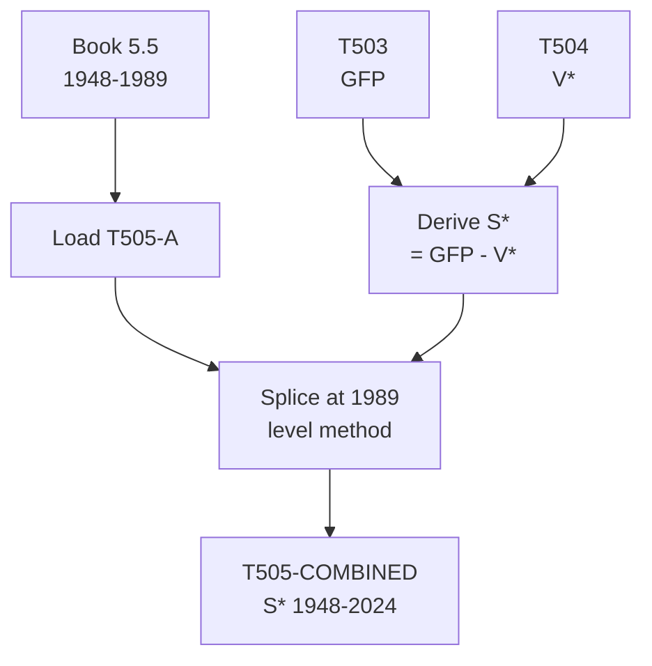

# T505: S* — Decomposition

## Quick Reference

| Property | Value |
|----------|-------|
| Series ID | T505 |
| Name | S* (Surplus value) |
| Chapter | 5 |
| Book Table | 5.5 |
| Period | 1948-2024 |
| Units | Billions of current dollars |
| Tier | 1 |
| Wave | 1 |

## Sub-Components

| Subseries | Name | Source | Period | Units |
|-----------|------|--------|--------|-------|
| T505-A | S* (book) | Book 5.5 | 1948-1989 | Billions $ |
| T505-EXT | S* (extension) | Derived from T503, T504 | 1990-2024 | Billions $ |
| T505-COMBINED | S* (full) | Spliced A+EXT | 1948-2024 | Billions $ |

## Construction Steps

| Step | Operation | Input | Output | Notes |
|------|-----------|-------|--------|-------|
| 1 | load | Book 5.5 | T505-A | Historical series 1948-1989 |
| 2 | derive | GFP - V* | T505-EXT | S* = GFP - V* for 1990-2024 |
| 3 | splice | T505-A, T505-EXT | T505-COMBINED | Splice at 1989, level method |

## Flow Diagram

## Source Methodology

See `Technical/research/T505_research.json` for full research documentation.

### Key Formula
S* = GFP - V*

Surplus value is the residual of classical value added after deducting variable capital (wages of productive workers).

### NIPA Sources
- Derived from T503 (GFP) and T504 (V*); no independent NIPA source.

## Related Series
- Upstream: T503 (GFP), T504 (V*)
- Downstream: T506 (e = S*/V*), T507 (S*/Y), T513 (r*), T514 (r*_adj)
