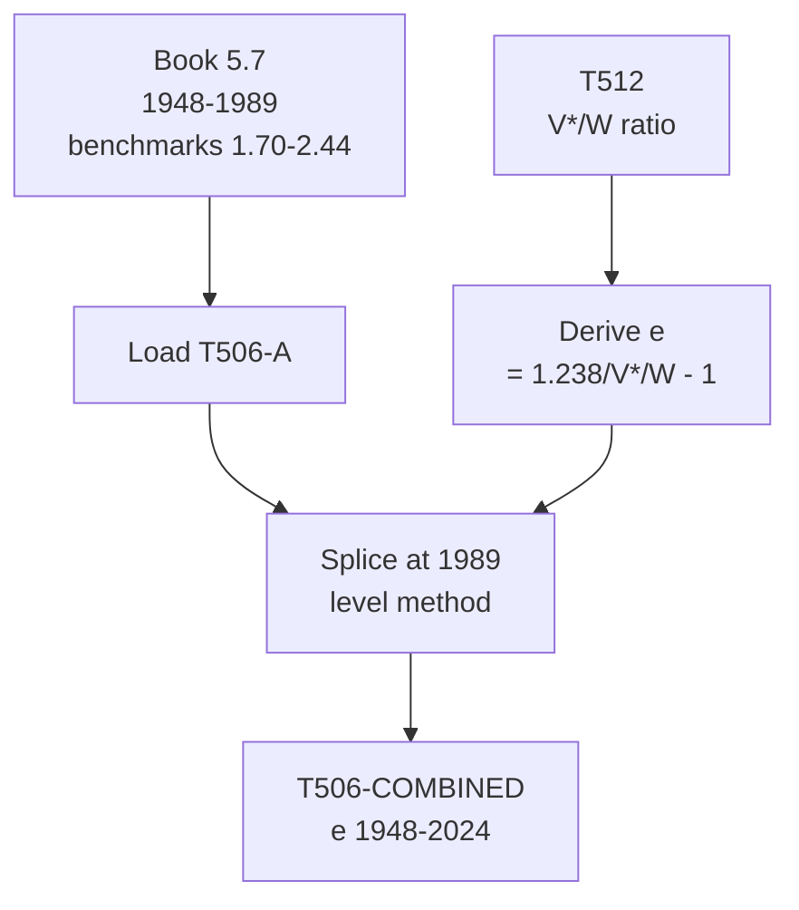

# T506: e — Decomposition

## Quick Reference

| Property | Value |
|----------|-------|
| Series ID | T506 |
| Name | e (Rate of surplus value, S*/V*) |
| Chapter | 5 |
| Book Table | 5.7 |
| Period | 1948-2024 |
| Units | Ratio (dimensionless) |
| Tier | 1 |
| Wave | 1 |

## Sub-Components

| Subseries | Name | Source | Period | Units |
|-----------|------|--------|--------|-------|
| T506-A | e (book) | Book 5.7 | 1948-1989 | Ratio (benchmarks 1.70-2.44) |
| T506-EXT | e (extension) | Derived formula | 1990-2024 | Ratio |
| T506-COMBINED | e (full) | Spliced A+EXT | 1948-2024 | Ratio |

## Construction Steps

| Step | Operation | Input | Output | Notes |
|------|-----------|-------|--------|-------|
| 1 | load | Book 5.7 | T506-A | Historical series, benchmarks 1.70-2.44 |
| 2 | derive | 1.238/(V*/W) - 1 | T506-EXT | Extension formula for 1990-2024 |
| 3 | splice | T506-A, T506-EXT | T506-COMBINED | Splice at 1989, level method |

## Flow Diagram

## Source Methodology

See `Technical/research/T506_research.json` for full research documentation.

### Key Formula
e = S*/V*

Extension approximation:
e = 1.238 / (V*/W) - 1

This formula exploits the identity that e = S*/V* = (GFP/V* - 1) and the empirical relationship between GFP/W and V*/W. The constant 1.238 is calibrated from the overlap period.

### NIPA Sources
- Derived from T512 (V*/W) for the extension period.
- Book 5.7 provides benchmark values from Shaikh's calculations.

## Related Series
- Upstream: T505 (S*), T504 (V*), T512 (V*/W)
- Downstream: None (terminal ratio)
