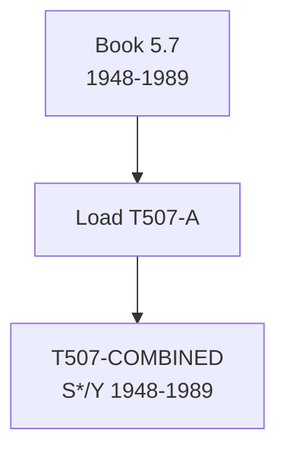

# T507: S*/Y — Decomposition

## Quick Reference

| Property | Value |
|----------|-------|
| Series ID | T507 |
| Name | S*/Y (Share of surplus in value added) |
| Chapter | 5 |
| Book Table | 5.7 |
| Period | 1948-1989 |
| Units | Ratio (dimensionless) |
| Tier | 1 |
| Wave | 1 |

## Sub-Components

| Subseries | Name | Source | Period | Units |
|-----------|------|--------|--------|-------|
| T507-A | S*/Y (book) | Book 5.7 | 1948-1989 | Ratio |

## Construction Steps

| Step | Operation | Input | Output | Notes |
|------|-----------|-------|--------|-------|
| 1 | load | Book 5.7 | T507-A | Historical series 1948-1989 |
| 2 | passthrough | T507-A | T507-COMBINED | No extension available |

## Flow Diagram

## Source Methodology

See `Technical/research/T507_research.json` for full research documentation.

### Key Formula
S*/Y = S* / (S* + V*)

Where Y = S* + V* = classical value added (net of materials). This ratio measures the share of surplus value in net output, analogous to the profit share in national accounts but defined in classical terms.

### NIPA Sources
- Book 5.7 provides the only available series. Can be cross-checked via T505/T504.

## Related Series
- Upstream: T505 (S*), T504 (V*)
- Downstream: None (terminal ratio)
