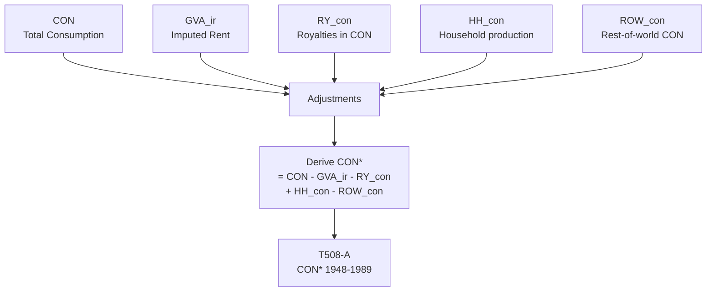

# T508: CON* — Decomposition

## Quick Reference

| Property | Value |
|----------|-------|
| Series ID | T508 |
| Name | CON* (Classical consumption) |
| Chapter | 5 |
| Book Table | E.2 |
| Period | 1948-1989 |
| Units | Billions of current dollars |
| Tier | 1 |
| Wave | 1 |

## Sub-Components

| Subseries | Name | Source | Period | Units |
|-----------|------|--------|--------|-------|
| T508-A | CON* (book) | Book E.2 | 1948-1989 | Billions $ |

## Construction Steps

| Step | Operation | Input | Output | Notes |
|------|-----------|-------|--------|-------|
| 1 | load | Book E.2 | T508-A | Historical series 1948-1989 |
| 2 | passthrough | T508-A | T508-COMBINED | No extension; formula documented below |

## Flow Diagram

## Source Methodology

See `Technical/research/T508_research.json` for full research documentation.

### Key Formula
CON* = CON - GVA_ir - RY_con + HH_con - ROW_con

Where:
- CON = NIPA personal consumption expenditures
- GVA_ir = Imputed rental value of owner-occupied housing
- RY_con = Royalties allocated to consumption
- HH_con = Household production adjustment
- ROW_con = Rest-of-world consumption adjustment

### NIPA Sources
- BEA NIPA Table 1.1.5: Personal Consumption Expenditures
- Various adjustments from Book E.2 methodology

## Related Series
- Upstream: None (primary source with adjustments)
- Downstream: None (demand-side component)
