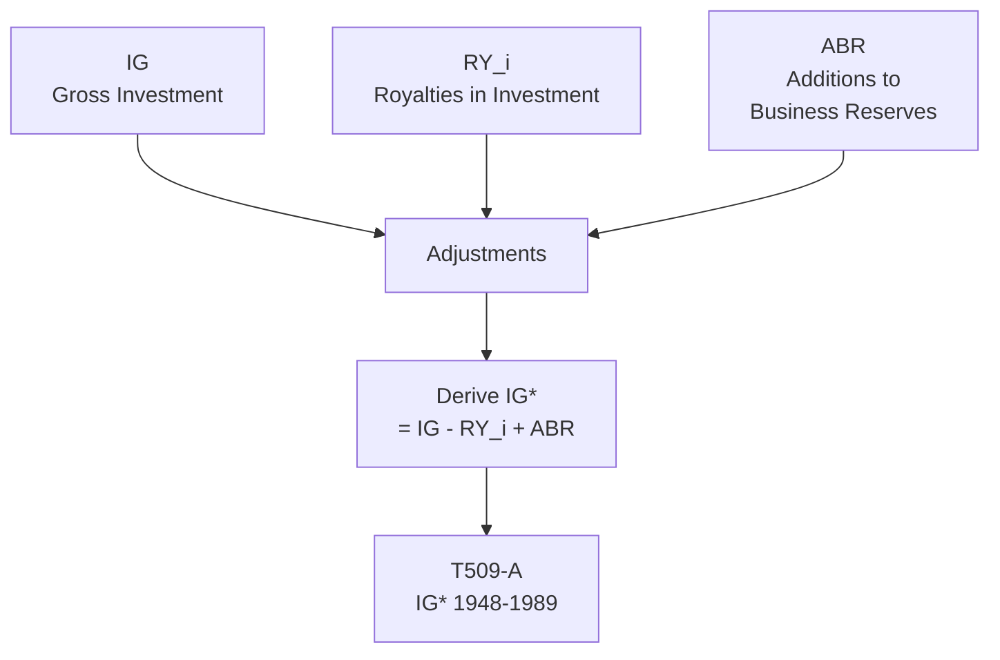

# T509: IG* — Decomposition

## Quick Reference

| Property | Value |
|----------|-------|
| Series ID | T509 |
| Name | IG* (Classical gross investment) |
| Chapter | 5 |
| Book Table | E.2 |
| Period | 1948-1989 |
| Units | Billions of current dollars |
| Tier | 1 |
| Wave | 1 |

## Sub-Components

| Subseries | Name | Source | Period | Units |
|-----------|------|--------|--------|-------|
| T509-A | IG* (book) | Book E.2 | 1948-1989 | Billions $ |

## Construction Steps

| Step | Operation | Input | Output | Notes |
|------|-----------|-------|--------|-------|
| 1 | load | Book E.2 | T509-A | Historical series 1948-1989 |
| 2 | passthrough | T509-A | T509-COMBINED | No extension; formula documented below |

## Flow Diagram

## Source Methodology

See `Technical/research/T509_research.json` for full research documentation.

### Key Formula
IG* = IG - RY_i + ABR

Where:
- IG = NIPA gross private domestic investment
- RY_i = Royalties allocated to investment
- ABR = Additions to business reserves (inventory valuation adjustment)

### NIPA Sources
- BEA NIPA Table 1.1.5: Gross Private Domestic Investment
- Various adjustments from Book E.2 methodology

## Related Series
- Upstream: None (primary source with adjustments)
- Downstream: None (demand-side component)
