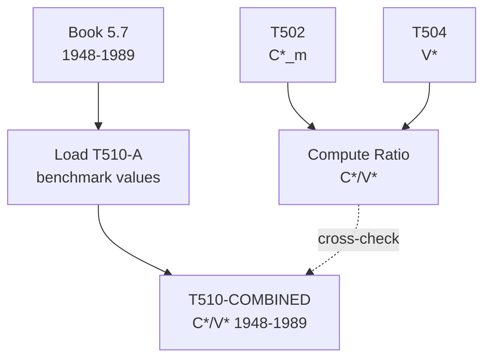

# T510: C*/V* — Decomposition

## Quick Reference

| Property | Value |
|----------|-------|
| Series ID | T510 |
| Name | C*/V* (Organic composition of capital) |
| Chapter | 5 |
| Book Table | 5.7 |
| Period | 1948-1989 |
| Units | Ratio (dimensionless) |
| Tier | 1 |
| Wave | 1 |

## Sub-Components

| Subseries | Name | Source | Period | Units |
|-----------|------|--------|--------|-------|
| T510-A | C*/V* (book) | Book 5.7 | 1948-1989 | Ratio |

## Construction Steps

| Step | Operation | Input | Output | Notes |
|------|-----------|-------|--------|-------|
| 1 | load | Book 5.7 | T510-A | Historical ratio series 1948-1989 |
| 2 | passthrough | T510-A | T510-COMBINED | Ratio of T502/T504 |

## Flow Diagram

## Source Methodology

See `Technical/research/T510_research.json` for full research documentation.

### Key Formula
C*/V* = C*_m / V*

The organic composition of capital measures the ratio of constant capital (materials) to variable capital (productive wages). In Marxian economics, a rising C*/V* is a key driver of the tendency of the rate of profit to fall.

### NIPA Sources
- Derived from T502 (C*_m) and T504 (V*). Book 5.7 provides benchmark values.

## Related Series
- Upstream: T502 (C*_m), T504 (V*)
- Downstream: T513 (r* = S*/(C*+V*))
