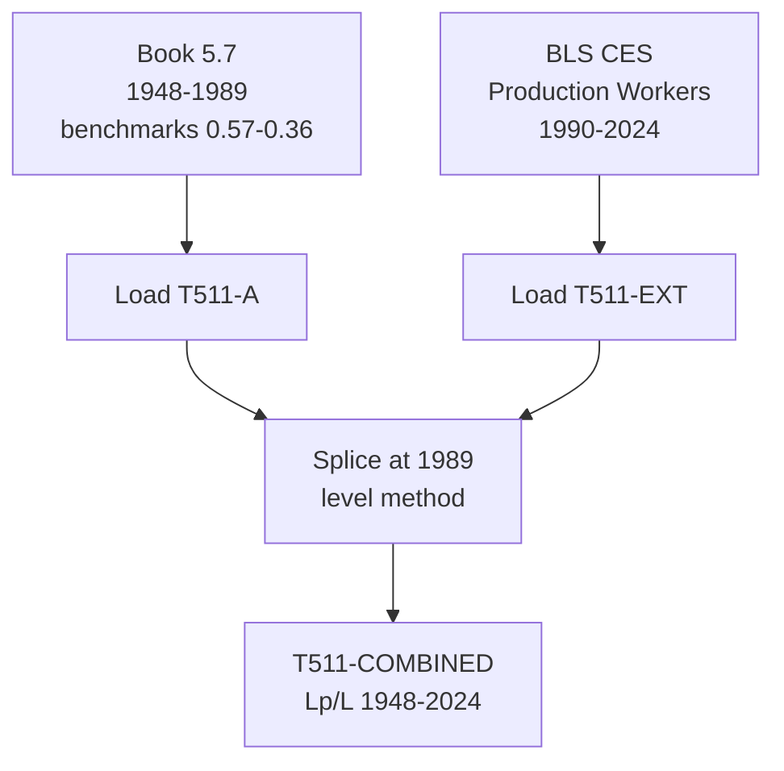

# T511: Lp/L — Decomposition

## Quick Reference

| Property | Value |
|----------|-------|
| Series ID | T511 |
| Name | Lp/L (Productive labor share) |
| Chapter | 5 |
| Book Table | 5.7 |
| Period | 1948-2024 |
| Units | Ratio (dimensionless) |
| Tier | 1 |
| Wave | 1 |

## Sub-Components

| Subseries | Name | Source | Period | Units |
|-----------|------|--------|--------|-------|
| T511-A | Lp/L (book) | Book 5.7 | 1948-1989 | Ratio (benchmarks 0.57-0.36) |
| T511-EXT | Lp/L (extension) | BLS CES | 1990-2024 | Ratio |
| T511-COMBINED | Lp/L (full) | Spliced A+EXT | 1948-2024 | Ratio |

## Construction Steps

| Step | Operation | Input | Output | Notes |
|------|-----------|-------|--------|-------|
| 1 | load | Book 5.7 | T511-A | Historical series, benchmarks 0.57-0.36 |
| 2 | load | BLS CES production workers | T511-EXT | Production/nonsupervisory share 1990-2024 |
| 3 | splice | T511-A, T511-EXT | T511-COMBINED | Splice at 1989, level method |

## Flow Diagram

## Source Methodology

See `Technical/research/T511_research.json` for full research documentation.

### Key Formula
Lp/L = Productive workers / Total employment

Where productive workers are those engaged in the production of goods and services in the classical sense (excluding financial, governmental, and other non-productive sectors).

### NIPA Sources
- BLS Current Employment Statistics (CES): Production and nonsupervisory workers as a share of total nonfarm employment.
- The declining trend (0.57 to 0.36) reflects the structural shift from manufacturing to services.

## Related Series
- Upstream: T515 (Lp), BLS total employment (L)
- Downstream: T512 (V*/W approximation)
