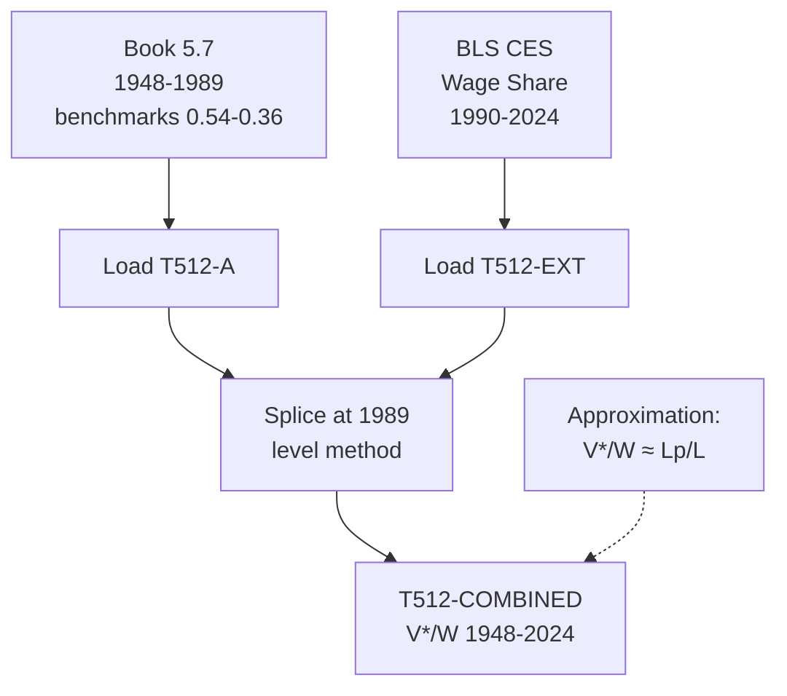

# T512: V*/W — Decomposition

## Quick Reference

| Property | Value |
|----------|-------|
| Series ID | T512 |
| Name | V*/W (Productive wage share) |
| Chapter | 5 |
| Book Table | 5.7 |
| Period | 1948-2024 |
| Units | Ratio (dimensionless) |
| Tier | 1 |
| Wave | 1 |

## Sub-Components

| Subseries | Name | Source | Period | Units |
|-----------|------|--------|--------|-------|
| T512-A | V*/W (book) | Book 5.7 | 1948-1989 | Ratio (benchmarks 0.54-0.36) |
| T512-EXT | V*/W (extension) | BLS CES | 1990-2024 | Ratio |
| T512-COMBINED | V*/W (full) | Spliced A+EXT | 1948-2024 | Ratio |

## Construction Steps

| Step | Operation | Input | Output | Notes |
|------|-----------|-------|--------|-------|
| 1 | load | Book 5.7 | T512-A | Historical series, benchmarks 0.54-0.36 |
| 2 | load | BLS CES | T512-EXT | Production worker wage share 1990-2024 |
| 3 | splice | T512-A, T512-EXT | T512-COMBINED | Splice at 1989, level method |

## Flow Diagram

## Source Methodology

See `Technical/research/T512_research.json` for full research documentation.

### Key Formula
V*/W = Productive wages / Total wages

Approximation: V*/W ≈ Lp/L (productive labor share). This holds when average wages of productive and unproductive workers are roughly equal.

### NIPA Sources
- BLS Current Employment Statistics (CES): Production and nonsupervisory worker earnings relative to total compensation.
- The approximation V*/W ≈ Lp/L is validated by the close tracking of Book 5.7 benchmarks (0.54 vs 0.57 for Lp/L).

## Related Series
- Upstream: T511 (Lp/L as approximation)
- Downstream: T504 (V* = W × V*/W), T506 (e extension formula)
