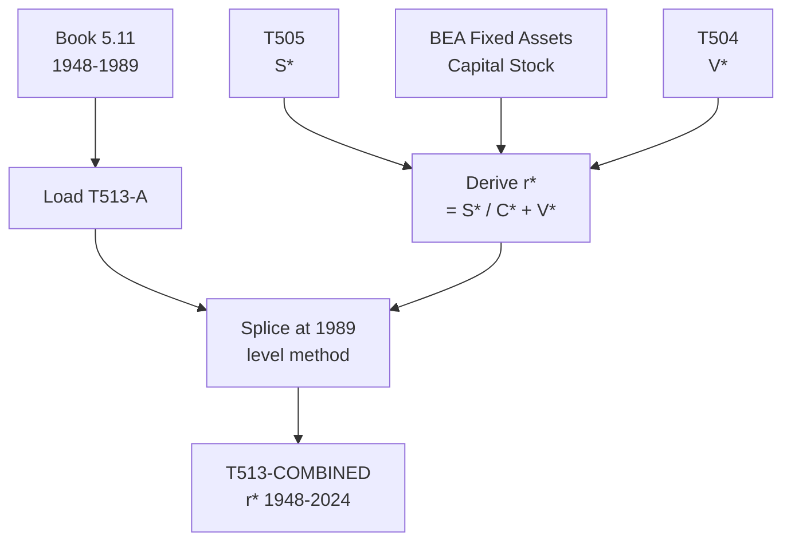

# T513: r* — Decomposition

## Quick Reference

| Property | Value |
|----------|-------|
| Series ID | T513 |
| Name | r* (General rate of profit) |
| Chapter | 5 |
| Book Table | 5.11 |
| Period | 1948-2024 |
| Units | Ratio (dimensionless) |
| Tier | 1 |
| Wave | 1 |

## Sub-Components

| Subseries | Name | Source | Period | Units |
|-----------|------|--------|--------|-------|
| T513-A | r* (book) | Book 5.11 | 1948-1989 | Ratio |
| T513-EXT | r* (extension) | BEA Fixed Assets + derived | 1990-2024 | Ratio |
| T513-COMBINED | r* (full) | Spliced A+EXT | 1948-2024 | Ratio |

## Construction Steps

| Step | Operation | Input | Output | Notes |
|------|-----------|-------|--------|-------|
| 1 | load | Book 5.11 | T513-A | Historical series 1948-1989 |
| 2 | load | BEA Fixed Assets tables | C* (fixed capital) | Capital stock for extension |
| 3 | derive | S* / (C* + V*) | T513-EXT | Rate of profit 1990-2024 |
| 4 | splice | T513-A, T513-EXT | T513-COMBINED | Splice at 1989, level method |

## Flow Diagram

## Source Methodology

See `Technical/research/T513_research.json` for full research documentation.

### Key Formula
r* = S* / (C* + V*)

Where:
- S* = surplus value (T505)
- C* = constant capital (fixed capital stock from BEA Fixed Assets tables)
- V* = variable capital (T504)

This is the classical/Marxian general rate of profit, measuring surplus value relative to total capital advanced.

### NIPA Sources
- BEA Fixed Assets Table 6.1: Current-Cost Net Stock of Private Fixed Assets by Industry
- T505 (S*) and T504 (V*) provide the numerator and part of the denominator.

## Related Series
- Upstream: T505 (S*), T504 (V*), T502 (C*_m)
- Downstream: T514 (r*_adj)
