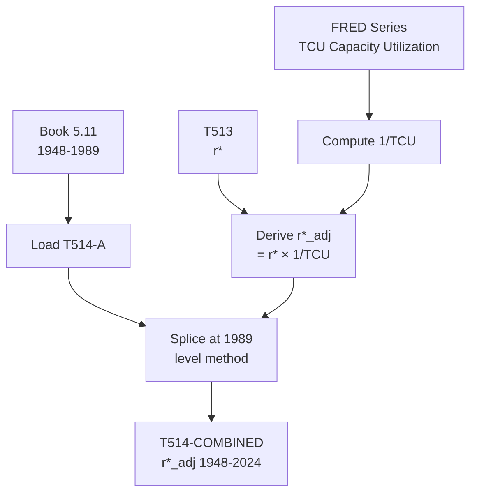

# T514: r*_adj — Decomposition

## Quick Reference

| Property | Value |
|----------|-------|
| Series ID | T514 |
| Name | r*_adj (Capacity-adjusted rate of profit) |
| Chapter | 5 |
| Book Table | 5.11 |
| Period | 1948-2024 |
| Units | Ratio (dimensionless) |
| Tier | 1 |
| Wave | 1 |

## Sub-Components

| Subseries | Name | Source | Period | Units |
|-----------|------|--------|--------|-------|
| T514-A | r*_adj (book) | Book 5.11 | 1948-1989 | Ratio |
| T514-EXT | r*_adj (extension) | FRED TCU + derived | 1990-2024 | Ratio |
| T514-COMBINED | r*_adj (full) | Spliced A+EXT | 1948-2024 | Ratio |

## Construction Steps

| Step | Operation | Input | Output | Notes |
|------|-----------|-------|--------|-------|
| 1 | load | Book 5.11 | T514-A | Historical series 1948-1989 |
| 2 | load | FRED TCU (capacity utilization) | TCU | Federal Reserve capacity utilization rate |
| 3 | derive | r* × (1/TCU) | T514-EXT | Capacity-adjusted rate of profit 1990-2024 |
| 4 | splice | T514-A, T514-EXT | T514-COMBINED | Splice at 1989, level method |

## Flow Diagram

## Source Methodology

See `Technical/research/T514_research.json` for full research documentation.

### Key Formula
r*_adj = r* × (1 / TCU)

Where:
- r* = general rate of profit (T513)
- TCU = total capacity utilization (FRED series TCU, Federal Reserve)

The adjustment accounts for the fact that actual profit rates are depressed during recessions due to idle capacity. Dividing by TCU yields the profit rate that would prevail at full capacity utilization.

### NIPA Sources
- Federal Reserve: Capacity Utilization: Total Industry (FRED series TCU)
- T513 (r*) provides the unadjusted rate of profit.

## Related Series
- Upstream: T513 (r*), FRED TCU
- Downstream: None (terminal series)
