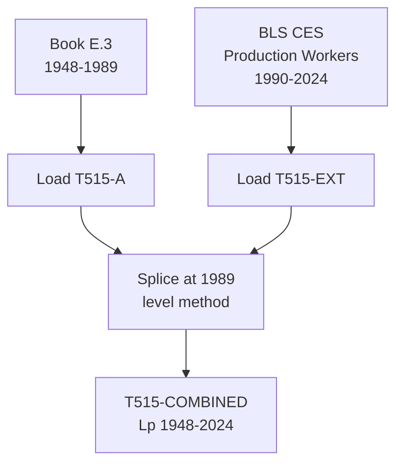

# T515: Lp — Decomposition

## Quick Reference

| Property | Value |
|----------|-------|
| Series ID | T515 |
| Name | Lp (Productive employment) |
| Chapter | 5 |
| Book Table | E.3 |
| Period | 1948-2024 |
| Units | Thousands of workers |
| Tier | 1 |
| Wave | 1 |

## Sub-Components

| Subseries | Name | Source | Period | Units |
|-----------|------|--------|--------|-------|
| T515-A | Lp (book) | Book E.3 | 1948-1989 | Thousands |
| T515-EXT | Lp (extension) | BLS CES | 1990-2024 | Thousands |
| T515-COMBINED | Lp (full) | Spliced A+EXT | 1948-2024 | Thousands |

## Construction Steps

| Step | Operation | Input | Output | Notes |
|------|-----------|-------|--------|-------|
| 1 | load | Book E.3 | T515-A | Historical series 1948-1989 |
| 2 | load | BLS CES production workers | T515-EXT | Production/nonsupervisory workers 1990-2024 |
| 3 | splice | T515-A, T515-EXT | T515-COMBINED | Splice at 1989, level method |

## Flow Diagram

## Source Methodology

See `Technical/research/T515_research.json` for full research documentation.

### Key Formula
Lp = Total productive employment

Productive workers are those engaged in the production of goods and material services in the classical sense. This excludes financial sector workers, government employees, and other categories classified as unproductive in classical political economy.

### NIPA Sources
- BLS Current Employment Statistics (CES): Production and nonsupervisory workers on private nonfarm payrolls.
- Book E.3 provides the benchmark classification based on Shaikh's productive/unproductive labor distinction.

## Related Series
- Upstream: None (primary source)
- Downstream: T511 (Lp/L), T516 (Lu = L - Lp)
