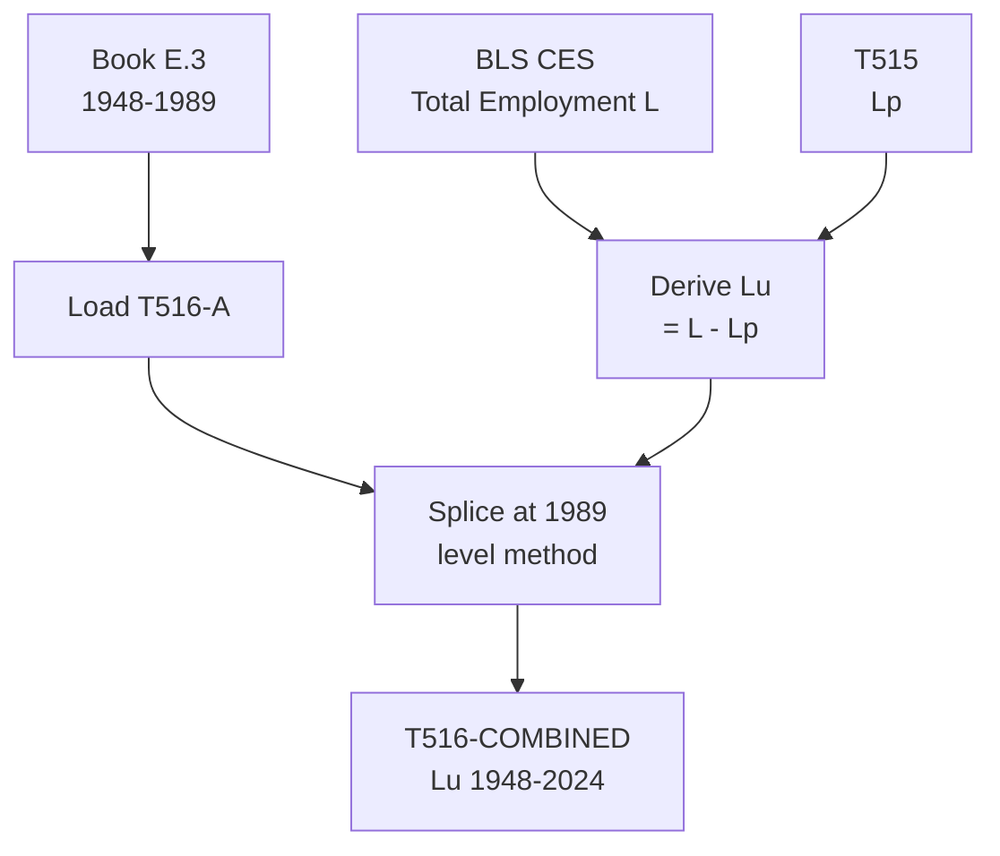

# T516: Lu — Decomposition

## Quick Reference

| Property | Value |
|----------|-------|
| Series ID | T516 |
| Name | Lu (Unproductive employment) |
| Chapter | 5 |
| Book Table | E.3 |
| Period | 1948-2024 |
| Units | Thousands of workers |
| Tier | 1 |
| Wave | 1 |

## Sub-Components

| Subseries | Name | Source | Period | Units |
|-----------|------|--------|--------|-------|
| T516-A | Lu (book) | Book E.3 | 1948-1989 | Thousands |
| T516-EXT | Lu (extension) | Derived from L - Lp | 1990-2024 | Thousands |
| T516-COMBINED | Lu (full) | Spliced A+EXT | 1948-2024 | Thousands |

## Construction Steps

| Step | Operation | Input | Output | Notes |
|------|-----------|-------|--------|-------|
| 1 | load | Book E.3 | T516-A | Historical series 1948-1989 |
| 2 | load | BLS total employment | L | Total nonfarm employment 1990-2024 |
| 3 | derive | L - Lp | T516-EXT | Unproductive = Total - Productive |
| 4 | splice | T516-A, T516-EXT | T516-COMBINED | Splice at 1989, level method |

## Flow Diagram

## Source Methodology

See `Technical/research/T516_research.json` for full research documentation.

### Key Formula
Lu = L - Lp

Where:
- L = Total nonfarm employment (BLS CES)
- Lp = Productive employment (T515)

Unproductive labor includes financial sector workers, government employees, and other categories that do not directly produce goods and material services in the classical sense.

### NIPA Sources
- BLS Current Employment Statistics (CES): Total nonfarm employment.
- T515 (Lp) provides the productive employment count to subtract.

## Related Series
- Upstream: T515 (Lp), BLS total employment (L)
- Downstream: None (terminal series)
