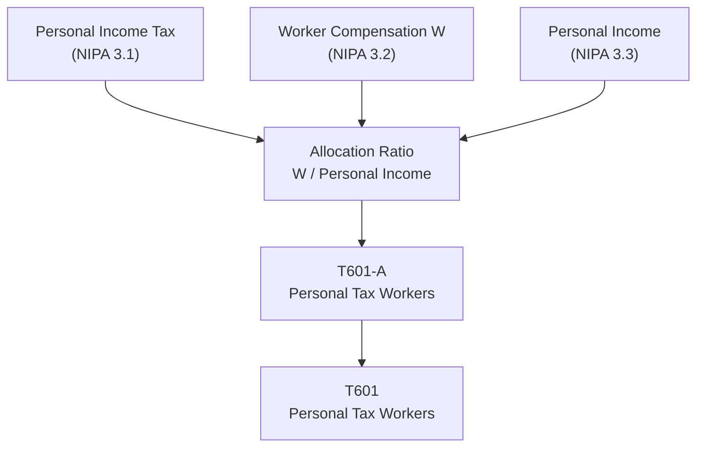

# T601: Personal Tax Workers — Decomposition

## Quick Reference

| Property | Value |
|----------|-------|
| Series ID | T601 |
| Name | Personal Tax Workers |
| Chapter | 6 |
| Book Table | 6.1 |
| Period | 1952-1989 |
| Units | Billions of current dollars |
| Tier | 1 |
| Wave | 1 |

## Sub-Components

| Subseries | Name | Source | Period | Units |
|-----------|------|--------|--------|-------|
| T601-A | Personal income tax allocated to workers | Book 6.1; NIPA 3.1, 3.2, 3.3 | 1952-1989 | Billions of current dollars |

## Construction Steps

| Step | Operation | Input | Output | Notes |
|------|-----------|-------|--------|-------|
| 1 | Load | T601-A raw data | T601-A series | Personal income tax × (W / personal income) |

## Flow Diagram

## Source Methodology

See `Technical/research/T601_research.json` for full research documentation.

Personal income tax is allocated to workers using the ratio of worker compensation (W) to total personal income, drawing on NIPA Tables 3.1, 3.2, and 3.3.

## Related Series

- **T602** — Social Insurance Tax Workers
- **T603** — Property Tax Workers
- **T604** — Total Tax Workers (uses T601 as input)
