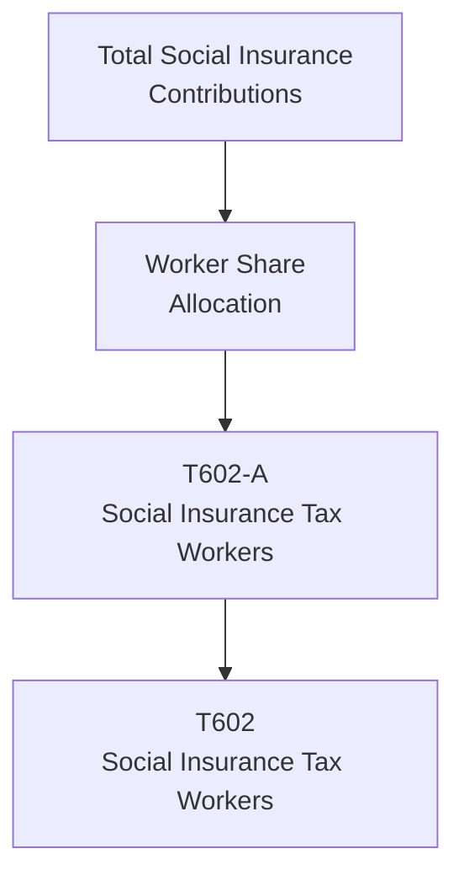

# T602: Social Insurance Tax Workers — Decomposition

## Quick Reference

| Property | Value |
|----------|-------|
| Series ID | T602 |
| Name | Social Insurance Tax Workers |
| Chapter | 6 |
| Book Table | 6.1 |
| Period | 1952-1989 |
| Units | Billions of current dollars |
| Tier | 1 |
| Wave | 1 |

## Sub-Components

| Subseries | Name | Source | Period | Units |
|-----------|------|--------|--------|-------|
| T602-A | Social insurance contributions allocated to workers | Book 6.1 | 1952-1989 | Billions of current dollars |

## Construction Steps

| Step | Operation | Input | Output | Notes |
|------|-----------|-------|--------|-------|
| 1 | Load | T602-A raw data | T602-A series | Total social insurance contributions × worker share |

## Flow Diagram

## Source Methodology

See `Technical/research/T602_research.json` for full research documentation.

Total social insurance contributions are split between workers and non-workers. The worker share is derived from employer and employee contributions attributable to wage and salary earners.

## Related Series

- **T601** — Personal Tax Workers
- **T603** — Property Tax Workers
- **T604** — Total Tax Workers (uses T602 as input)
