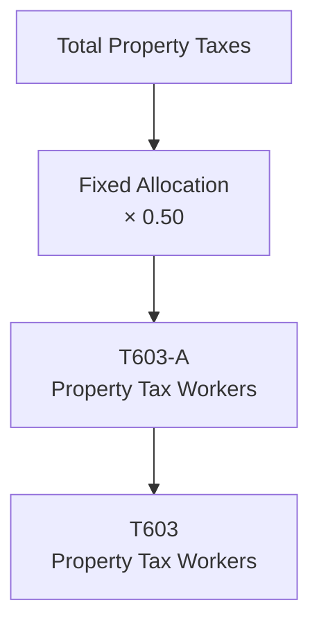

# T603: Property Tax Workers — Decomposition

## Quick Reference

| Property | Value |
|----------|-------|
| Series ID | T603 |
| Name | Property Tax Workers |
| Chapter | 6 |
| Book Table | 6.1 |
| Period | 1952-1989 |
| Units | Billions of current dollars |
| Tier | 1 |
| Wave | 1 |

## Sub-Components

| Subseries | Name | Source | Period | Units |
|-----------|------|--------|--------|-------|
| T603-A | Property taxes allocated to workers | Book 6.1 | 1952-1989 | Billions of current dollars |

## Construction Steps

| Step | Operation | Input | Output | Notes |
|------|-----------|-------|--------|-------|
| 1 | Load | T603-A raw data | T603-A series | Property taxes × 0.50 worker share |

## Flow Diagram

## Source Methodology

See `Technical/research/T603_research.json` for full research documentation.

Property taxes are allocated to workers using a fixed 50% share, reflecting the assumption that approximately half of property tax burden falls on workers through housing costs and indirect channels.

## Related Series

- **T601** — Personal Tax Workers
- **T602** — Social Insurance Tax Workers
- **T604** — Total Tax Workers (uses T603 as input)
