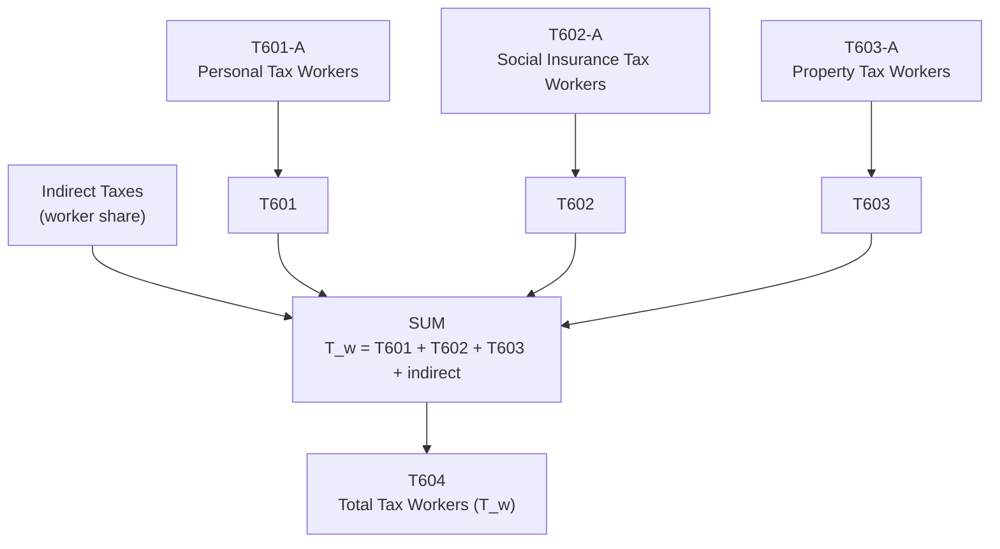

# T604: Total Tax Workers — Decomposition

## Quick Reference

| Property | Value |
|----------|-------|
| Series ID | T604 |
| Name | Total Tax Workers |
| Chapter | 6 |
| Book Table | 6.1 |
| Period | 1952-1989 |
| Units | Billions of current dollars |
| Tier | 1 |
| Wave | 1 |

## Sub-Components

| Subseries | Name | Source | Period | Units |
|-----------|------|--------|--------|-------|
| T604-A | Total tax on workers (combined) | Book 6.1 | 1952-1989 | Billions of current dollars |

## Construction Steps

| Step | Operation | Input | Output | Notes |
|------|-----------|-------|--------|-------|
| 1 | Load | T601-A | T601 series | Personal tax on workers |
| 2 | Load | T602-A | T602 series | Social insurance tax on workers |
| 3 | Load | T603-A | T603 series | Property tax on workers |
| 4 | Derive | T601 + T602 + T603 + indirect | T604 (T_w) | Sum of all tax components |

## Flow Diagram

## Source Methodology

See `Technical/research/T604_research.json` for full research documentation.

Total tax on workers (T_w) is the sum of personal income tax (T601), social insurance contributions (T602), property taxes (T603), and indirect taxes allocated to workers. This combined tax burden is used in the net social wage calculation.

## Related Series

- **T601** — Personal Tax Workers (input)
- **T602** — Social Insurance Tax Workers (input)
- **T603** — Property Tax Workers (input)
- **T607** — Net Social Wage (uses T604 as input)
