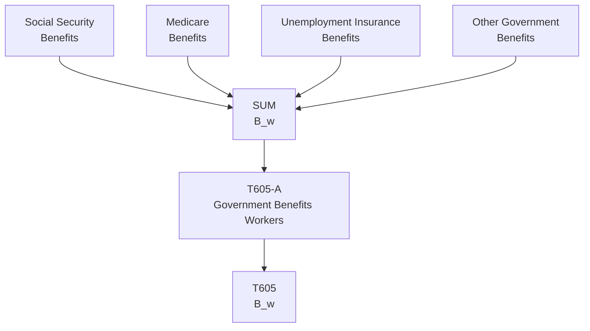

# T605: Government Benefits Workers — Decomposition

## Quick Reference

| Property | Value |
|----------|-------|
| Series ID | T605 |
| Name | Government Benefits Workers (B_w) |
| Chapter | 6 |
| Book Table | 6.2 |
| Period | 1952-1989 |
| Units | Billions of current dollars |
| Tier | 1 |
| Wave | 1 |

## Sub-Components

| Subseries | Name | Source | Period | Units |
|-----------|------|--------|--------|-------|
| T605-A | Government cash and in-kind benefits to workers | Book 6.2 | 1952-1989 | Billions of current dollars |

## Construction Steps

| Step | Operation | Input | Output | Notes |
|------|-----------|-------|--------|-------|
| 1 | Load | T605-A raw data | T605-A series | Social Security + Medicare + UI + other benefits |

## Flow Diagram

## Source Methodology

See `Technical/research/T605_research.json` for full research documentation.

Government benefits to workers (B_w) include Social Security payments, Medicare benefits, unemployment insurance, and other transfer payments directed to the working class. These are summed to produce the total benefit flow.

## Related Series

- **T606** — Government Services Workers (G_w)
- **T607** — Net Social Wage (uses T605 as input: NSW = B_w + G_w - T_w)
