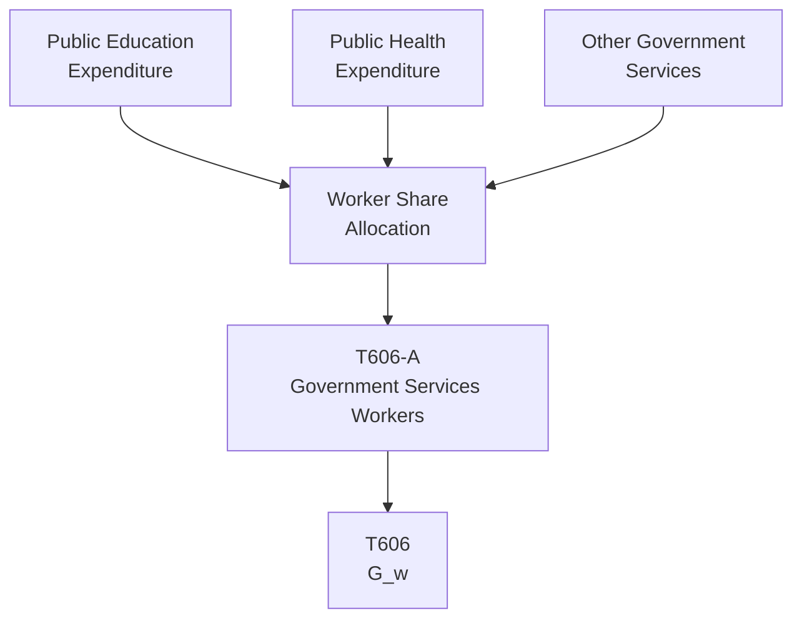

# T606: Government Services Workers — Decomposition

## Quick Reference

| Property | Value |
|----------|-------|
| Series ID | T606 |
| Name | Government Services Workers (G_w) |
| Chapter | 6 |
| Book Table | 6.2 |
| Period | 1952-1989 |
| Units | Billions of current dollars |
| Tier | 1 |
| Wave | 1 |

## Sub-Components

| Subseries | Name | Source | Period | Units |
|-----------|------|--------|--------|-------|
| T606-A | Government services allocated to workers | Book 6.2 | 1952-1989 | Billions of current dollars |

## Construction Steps

| Step | Operation | Input | Output | Notes |
|------|-----------|-------|--------|-------|
| 1 | Load | T606-A raw data | T606-A series | (Education + health + other services) × worker share |

## Flow Diagram

## Source Methodology

See `Technical/research/T606_research.json` for full research documentation.

Government services to workers (G_w) are derived by allocating public expenditure on education, health, and other services to workers based on their share of the population or relevant usage metrics.

## Related Series

- **T605** — Government Benefits Workers (B_w)
- **T607** — Net Social Wage (uses T606 as input: NSW = B_w + G_w - T_w)
