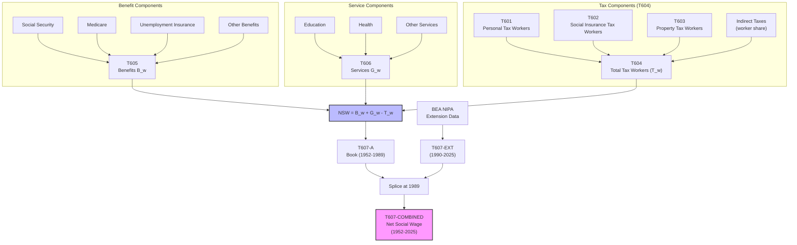

# T607: Net Social Wage — Decomposition

## Quick Reference

| Property | Value |
|----------|-------|
| Series ID | T607 |
| Name | Net Social Wage (NSW) |
| Chapter | 6 |
| Book Table | 6.3 |
| Period | 1952-2025 |
| Units | Billions of current dollars |
| Tier | 1 |
| Wave | 1 |

## Sub-Components

| Subseries | Name | Source | Period | Units |
|-----------|------|--------|--------|-------|
| T607-A | Net Social Wage (book data) | Book 6.3 | 1952-1989 | Billions of current dollars |
| T607-EXT | Net Social Wage (extension) | BEA NIPA | 1990-2025 | Billions of current dollars |
| T607-COMBINED | Net Social Wage (spliced) | A + EXT | 1952-2025 | Billions of current dollars |

## Construction Steps

| Step | Operation | Input | Output | Notes |
|------|-----------|-------|--------|-------|
| 1 | Load | T607-A raw data | T607-A series | Book period NSW |
| 2 | Derive | T605 (B_w) + T606 (G_w) - T604 (T_w) | NSW calculation | NSW = B_w + G_w - T_w |
| 3 | Splice | T607-A, T607-EXT | T607-COMBINED | Splice at 1989; BEA NIPA extends 1990-2025 |

## Flow Diagram

## Source Methodology

See `Technical/research/T607_research.json` for full research documentation.

The Net Social Wage (NSW) measures the net fiscal impact of government on workers: benefits received (B_w) plus services consumed (G_w) minus taxes paid (T_w). The book data covers 1952-1989 and is extended through 2025 using BEA NIPA data, with a splice at 1989.

Key figures: 6.1, 6.3, 6.4.

## Related Series

- **T604** — Total Tax Workers (input: T_w)
- **T605** — Government Benefits Workers (input: B_w)
- **T606** — Government Services Workers (input: G_w)
- **T608** — NSW/V* (uses T607 as numerator)
- **T609** — NSW/NI (uses T607 as numerator)
- **T901** — Summary Table (includes T607-derived ratios)
