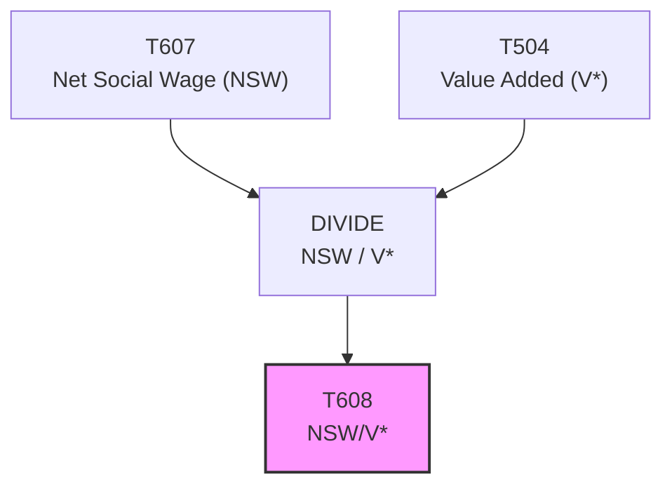

# T608: NSW/V* — Decomposition

## Quick Reference

| Property | Value |
|----------|-------|
| Series ID | T608 |
| Name | NSW/V* (Net Social Wage relative to value added) |
| Chapter | 6 |
| Book Table | 6.4 |
| Period | 1952-2025 |
| Units | Ratio (dimensionless) |
| Tier | 1 |
| Wave | 1 |

## Sub-Components

| Subseries | Name | Source | Period | Units |
|-----------|------|--------|--------|-------|
| T608-A | NSW/V* ratio | Book 6.4 | 1952-1989 | Ratio |
| T608-COMBINED | NSW/V* ratio (full period) | Derived | 1952-2025 | Ratio |

## Construction Steps

| Step | Operation | Input | Output | Notes |
|------|-----------|-------|--------|-------|
| 1 | Derive | T607 (NSW) / T504 (V*) | T608 | Ratio of net social wage to value added |

## Flow Diagram

## Source Methodology

See `Technical/research/T608_research.json` for full research documentation.

NSW/V* expresses the net social wage as a fraction of total value added, providing a normalized measure of the fiscal impact of government on workers relative to the size of the productive economy.

## Related Series

- **T607** — Net Social Wage (numerator)
- **T504** — Value Added V* (denominator)
- **T609** — NSW/NI (alternative normalization)
- **T901** — Summary Table (includes T608)
