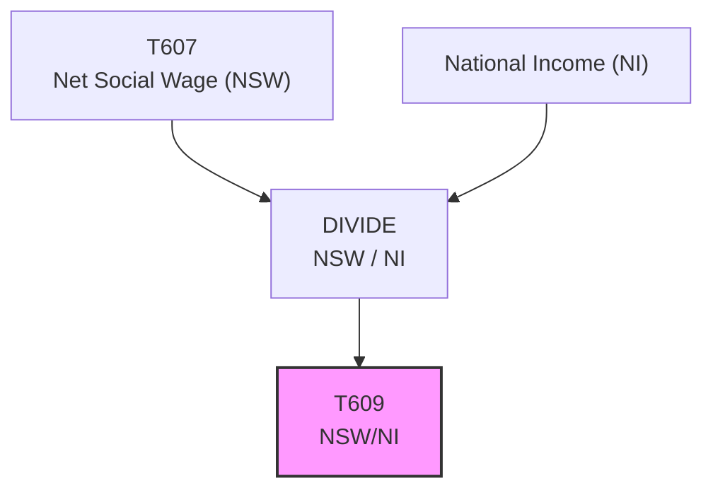

# T609: NSW/NI — Decomposition

## Quick Reference

| Property | Value |
|----------|-------|
| Series ID | T609 |
| Name | NSW/NI (Net Social Wage relative to National Income) |
| Chapter | 6 |
| Book Table | 6.4 |
| Period | 1952-2025 |
| Units | Ratio (dimensionless) |
| Tier | 1 |
| Wave | 1 |

## Sub-Components

| Subseries | Name | Source | Period | Units |
|-----------|------|--------|--------|-------|
| T609-A | NSW/NI ratio | Book 6.4 | 1952-1989 | Ratio |
| T609-COMBINED | NSW/NI ratio (full period) | Derived | 1952-2025 | Ratio |

## Construction Steps

| Step | Operation | Input | Output | Notes |
|------|-----------|-------|--------|-------|
| 1 | Derive | T607 (NSW) / NI | T609 | Ratio of net social wage to national income |

## Flow Diagram

## Source Methodology

See `Technical/research/T609_research.json` for full research documentation.

NSW/NI expresses the net social wage as a fraction of national income, providing a normalized measure of the fiscal impact of government on workers relative to the aggregate income of the economy.

## Related Series

- **T607** — Net Social Wage (numerator)
- **T608** — NSW/V* (alternative normalization using value added)
- **T901** — Summary Table (includes T609)
