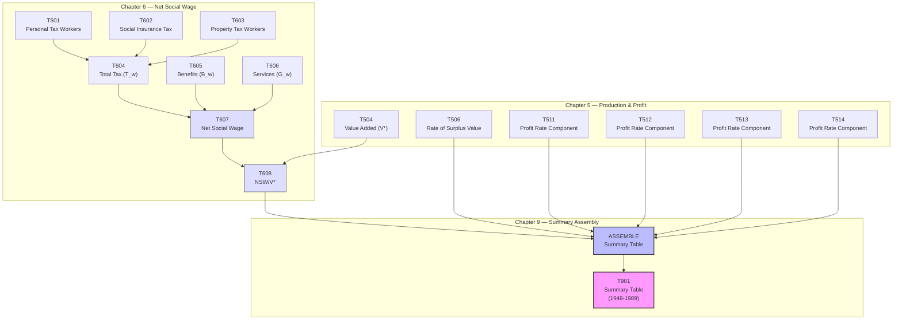

# T901: Summary Table — Decomposition

## Quick Reference

| Property | Value |
|----------|-------|
| Series ID | T901 |
| Name | Summary Table |
| Chapter | 9 |
| Book Table | 9.1 |
| Period | 1948-1989 |
| Units | Various (ratios, indices) |
| Tier | 1 |
| Wave | 1 |

## Sub-Components

| Subseries | Name | Source | Period | Units |
|-----------|------|--------|--------|-------|
| T901-A | Summary table (assembled) | Book 9.1 | 1948-1989 | Various |

## Construction Steps

| Step | Operation | Input | Output | Notes |
|------|-----------|-------|--------|-------|
| 1 | Load | T506 | Rate of surplus value | Chapter 5 series |
| 2 | Load | T511 | Profit rate component | Chapter 5 series |
| 3 | Load | T512 | Profit rate component | Chapter 5 series |
| 4 | Load | T513 | Profit rate component | Chapter 5 series |
| 5 | Load | T514 | Profit rate component | Chapter 5 series |
| 6 | Load | T608 | NSW/V* | Chapter 6 series |
| 7 | Assemble | T506, T511-T514, T608 | T901 | No independent NIPA inputs; pure assembly |

## Flow Diagram

## Source Methodology

See `Technical/research/T901_research.json` for full research documentation.

The Summary Table assembles key results from Chapters 5 and 6 into a single consolidated view. It draws on the rate of surplus value (T506), profit rate components (T511-T514), and the net social wage ratio (T608). No independent NIPA inputs are required — this is a pure assembly operation from upstream series.

Key figures: 9.1, 9.2, 9.3, 9.4, 9.5.

## Related Series

- **T506** — Rate of Surplus Value (input)
- **T511** — Profit Rate Component (input)
- **T512** — Profit Rate Component (input)
- **T513** — Profit Rate Component (input)
- **T514** — Profit Rate Component (input)
- **T608** — NSW/V* (input, which depends on T607 and T504)
