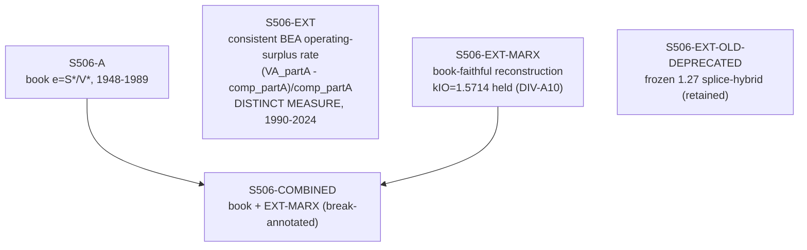

# S506 — Decomposition

**Series**: Rate of Exploitation (e = S*/V*)

> **Rebuilt 2026-07-01 (workpackage A comprehensive review).** The pre-review construction glued the
> book Marxian rate (2.44 @1989) onto a splice-inflated BEA rate (1.27 @1998), manufacturing
> the "strange drop" Prof. Tonak flagged. The forensic (`P1_FORENSIC_REPORT.md`) proved the
> break is ~100% method. See below for the honest rebuild.

## Construction Flow

## Step-by-step construction

**Step 1** — load book rate
  - Output: `S506-A` = Table 5.7 T506A / Appendix H.1 `S_star_V_star`, 1948-1989.

**Step 2** — extension PRIMARY (fully constructible, no held factors)
  - Output: `S506-EXT`
  - Formula: `e = (VA_partA − comp_partA) / comp_partA` over book partition A
    (goods+transport+trade: NAICS 11,21,22,23,31G,42,44RT,48TW), numerator and denominator on
    the SAME partition. 1990-1997 = real SIC-basis GDP-by-Industry (`data/source/bea_sic/`);
    1998-2024 = BEA GDP-by-Industry `va_components`.
  - This is a **distinct measure** from the book Marxian e (a gross operating-surplus rate over
    total productive compensation), carrying an explicit methodological-break flag. It rises
    smoothly (0.73 @1989-basis → 0.80 @1997/98 seam → 1.15 @2024): no spurious drop within a
    consistently-measured series.

**Step 3** — extension FAITHFUL-CONCEPT variant
  - Output: `S506-EXT-MARX`
  - Formula: `e = (kIO·VA_partA·(1−dp_ratio)) / (s512_raw·W_total) − 1`
  - `kIO = GFP*_1989 / VA_partA_1989(SIC) = 1.5714` is the book-terminal Shaikh–Tonak I-O
    final-demand uplift, **HELD** as a registered divergence (**DIV-A10**) — the reallocation
    is not constructible from BEA VA aggregates. `s512_raw` = de-spliced productive-wage share
    (raw NIPA 6.2D; **DIV-A11**). Lands ~2.5→3.9: brackets book 2.44 and continues up.

**Step 4** — combined (break-annotated)
  - Output: `S506-COMBINED` = `S506-A` (1948-1989) + `S506-EXT-MARX` (1990-2024).
  - Carries an explicit **methodological break** at the 1989/1990 seam (book Marxian I-O e →
    BEA-based reconstruction). Removes the spurious drop.

**Retained**: `S506-EXT-OLD-DEPRECATED` = the frozen pre-review splice-hybrid (1.27 @1998), kept
for transparency (nothing silently deleted).

## Extension

- Extension span: 1990-2024 (real BEA data throughout; log-linear bridges retired)
- Primary method: consistent BEA operating-surplus rate (constructible)
- Faithful variant: book-concept reconstruction with held I-O factor (DIV-A10)
- Depends on: real BEA GDP-by-Industry VA + NIPA 6.2D + NIPA T20100 (self-contained in P02_S506)
- Registered divergences: DIV-A10 (I-O non-constructibility of the book numerator), DIV-A11
  (retire the S512 level-splice)

## Why the book Marxian e is not reconstructible from BEA aggregates

The book numerator GFP*/VA* (book VA*_1989 = 4149.75) is a Shaikh–Tonak I-O final-demand
transform ~1.571× the BEA partition-A industry value added (SIC 1989 = 2776.8). That factor
lives in the I-O structure, not in any value-added-by-industry sum; the post-1994 I-O matrix
cache was found invalid (P2), and the extension does not use I-O tables. This is the documented
limit (DIV-A10), consistent with Mohun's faithful replication (1.87 @1989) also differing from
the book by definitional latitude.

## Provenance

See [`S506_DPR.md`](S506_DPR.md) for the canonical Data Provenance Record. Forensic:
`internal-notes/REVIEW_2026-07/P1_FORENSIC_REPORT.md`; rebuild: `WP-A_REPORT.md`.
