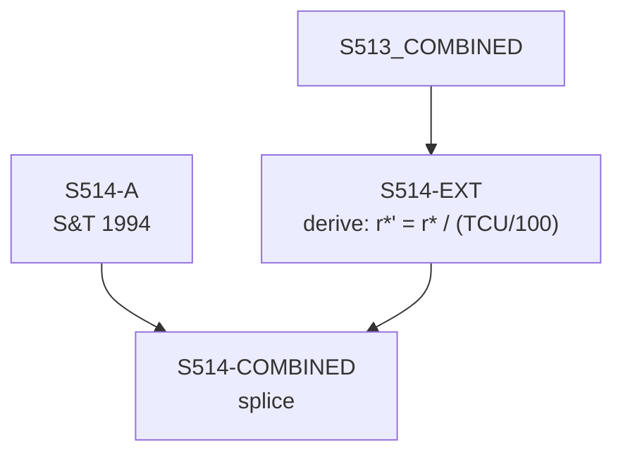

# S514 — Decomposition

**Series**: Capacity-Adjusted Profit Rate (r*' = r*/u, DIVIDE — D1 2026-07-02)

## Construction Flow

## Step-by-step construction

**Step 1** — load
  - Inputs: S514-A

**Step 2** — derive
  - Inputs: S513-COMBINED
  - Output: `S514-EXT`
  - Formula: `r*' = r* / (TCU/100)` (book period S514-A: `r*' = r* / u_book`)

**Step 3** — splice
  - Inputs: S514-A, S514-EXT
  - Output: `S514-COMBINED`
  - At year: 1989

## Extension

- Splice year: 1989
- Splice method: derive
- Depends on: S513

## Provenance

See [`S514_DPR.md`](S514_DPR.md) for the canonical Data Provenance Record, including source-file citations, validation benchmarks, and known caveats.
