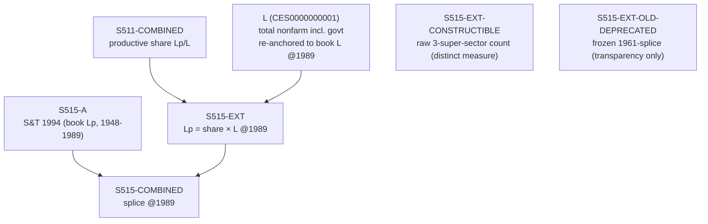

# S515 — Decomposition

**Series**: Productive Employment (Lp)

## Construction Flow

## Step-by-step construction

**Step 1** — load book arm
  - Inputs: S515-A (book Lp_total from TableE3, 1948-1989)

**Step 2** — build extension (book share×total method, FULL_TEXT L449)
  - Inputs: S511-COMBINED (productive share), L = CES0000000001 total nonfarm incl. govt, re-anchored to book L @1989
  - Output: `S515-EXT` = share × L, 1990-2024

**Step 3** — splice
  - Inputs: S515-A, S515-EXT
  - Output: `S515-COMBINED`
  - At year: 1989

**Honesty arms** (distinct measures, not the published Lp):
  - `S515-EXT-CONSTRUCTIBLE` — raw 3-super-sector production-worker count, unspliced (Lp/L ≈ 0.195 vs book 0.363)
  - `S515-EXT-OLD-DEPRECATED` — frozen pre-review arm (raw count level-spliced @1961); DEPRECATED, transparency only

## Extension

- Splice year: 1989 (both S515 and S516; the pre-review S515 anchor of 1961 was retired — REVIEW_2026-07 item D2)
- Splice method: share×total (Lp = S511 productive share × book-anchored total employment L; multiplicative L re-anchor + additive share splice, both @1989)
- Depends on: S511 (productive share), L = CES0000000001 (total nonfarm incl. government)
- Achieved seam (ext 1990 vs book 1989): Lp −0.7% — continuous, within the 5% guard

## Provenance

See [`S515_DPR.md`](S515_DPR.md) for the canonical Data Provenance Record, including source-file citations, validation benchmarks, and known caveats.
