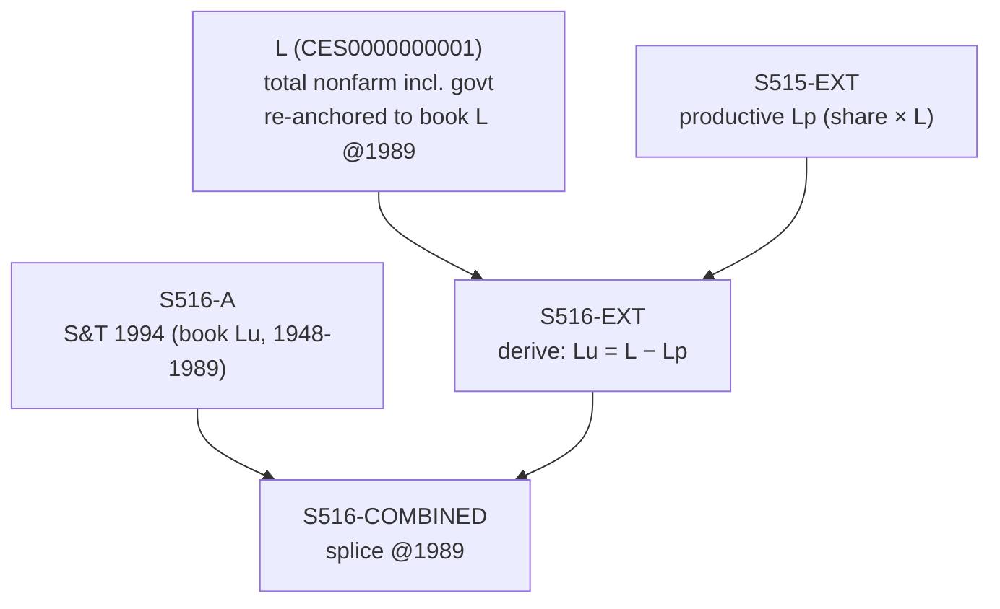

# S516 — Decomposition

**Series**: Unproductive Employment (Lu = L - Lp)

## Construction Flow

## Step-by-step construction

**Step 1** — load book arm
  - Inputs: S516-A (book Lu = L_total − Lp_total from TableE3, 1948-1989)

**Step 2** — derive extension (book residual rule, FULL_TEXT L449)
  - Inputs: L = CES0000000001 (total nonfarm incl. govt) re-anchored to book L @1989; S515-EXT (published productive Lp)
  - Output: `S516-EXT` = L − Lp, 1990-2024
  - Formula: `Lu = L − Lp` on the SAME single L basis S515 uses (identity holds at the seam)

**Step 3** — splice
  - Inputs: S516-A, S516-EXT
  - Output: `S516-COMBINED`
  - At year: 1989

## Extension

- Splice year: 1989 (shared with S515; no 1962-1989 gap)
- Splice method: derive (Lu = L − Lp; induced by S515-EXT + the shared book-anchored total-employment L incl. government, both anchored @1989)
- Depends on: S515 (Lp) and L = CES0000000001 (total nonfarm incl. government)
- Achieved seam (ext 1990 vs book 1989): Lu +2.6%, total L +1.4% — continuous, within the 5% guard

## Provenance

See [`S516_DPR.md`](S516_DPR.md) for the canonical Data Provenance Record, including source-file citations, validation benchmarks, and known caveats.
